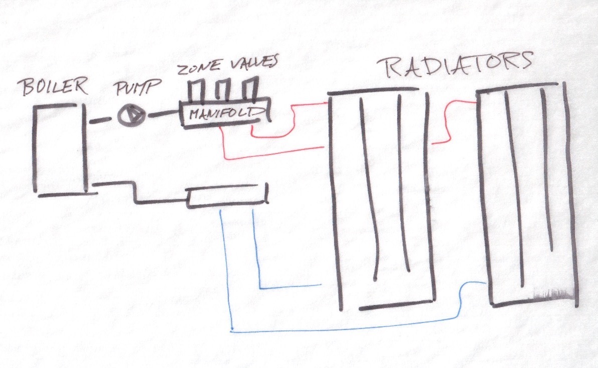
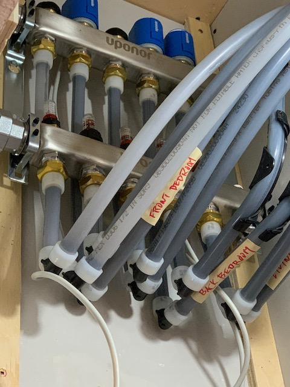
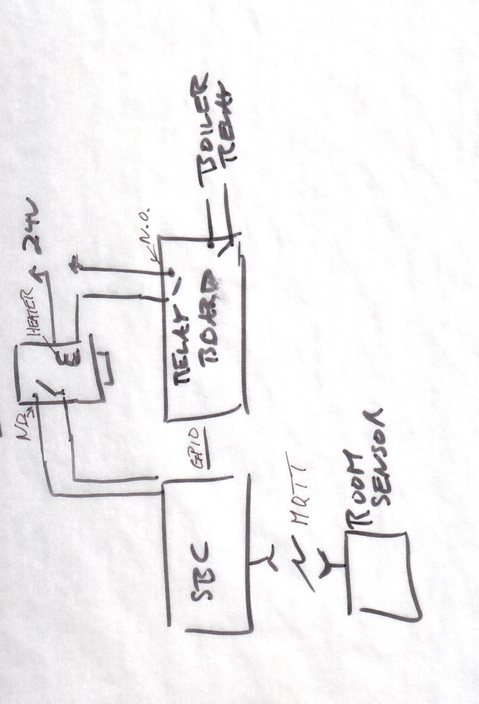
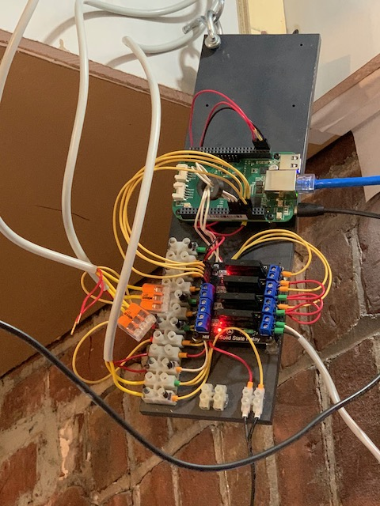
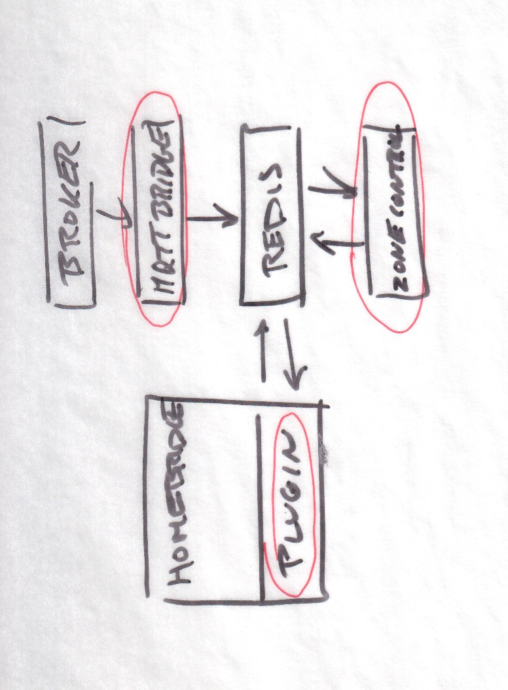
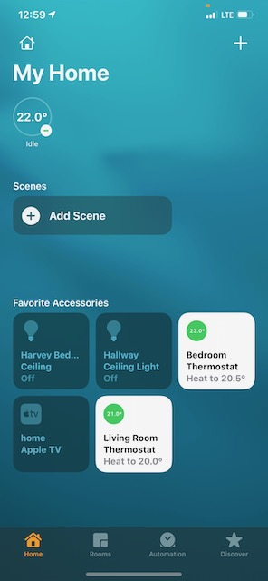

# A Homebridge plugin for hydronic heating user interface

 

### Very much experimental. Your mileage may vary

      
First off check out the excellent Homebridge project which makes this possible. This plugin serves as the UI for a series of virtual zone thermostats.

The philosophy guiding this project and its documentation is straightforward: get it working then make improvements as needed. Perfection is the enemy of progress.

# Plumbing

Overall the heating system is quite simple. A boiler is connected via a manifold with zone valves to a series of radiators. When a zone calls for heat, first the zone valve opens, and when that is complete, the boiler and pump are then turned on.

Manifold with zone valves

# Electronics
A beaglebone SBC running debian hosts all the software pieces as well as interfacing via GPIO to a relay board. The relays control the zone valves as well as the boiler

Beaglebone and relay board

# Software
This plugin contains no logic for control, it provides a UI for setting and reading the respective temperatures for each zone. I didn't want a monolithic piece of software, but rather something composed of much smaller parts, each of which I could experiment with and or replace.  
Sensor data is sent to an MQTT broker (mosquitto in this case). A simple bridge written in python publishes these values to redis. The homebridge plugin reads and writes respective values to redis. Another script, again written in python, toggles the physical gpios based on these values.

### TODO
Add links to daemon repos
